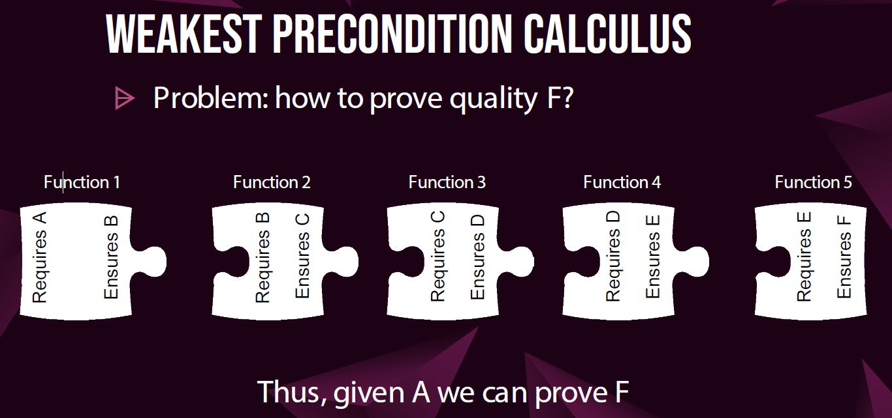

# SSA Verification

This repository holds the formal verification of the [Secure Socket API](https://github.com/markoneill/ssa-daemon) (SSA).

SSA is an API created by [Mark O'Neill](https://github.com/markoneill) that seeks to simplify the developer's process of creating a secure TLS connection.
With SSA, the developer can create a secure TLS connection by simple creating a socket and specify the ```IPPROTO_TLS``` protocol, and the SSA daemon will configure all the required TLS options.

However, how does one know that SSA correctly uses TLS for a secure connection?

Our formal verification methodology is as follows:

## Defining Secure Properties

First, in order to formally verify that SSA create a secure connection we need to define what a secure connection is.
To do so, we created a list of properties that define a secure connection.
They are as follows:

- Actually Connecting Via SSL (Encryption)
- Verify Certificate Chain
- Domain Name Checking
- Loaded Cert Authorities
- Ciphersuites (TLS 1.3)
- Cipher List (TLS 1.2 & lower)
- Setting Minimum Protocol Version
- Checking to See that the Server Actually Sent a Certificate
- Cert Revocation (Via OCSP Stapling)
- Cert Revocation (Via CRL Checking)
- Cert Revocation (Via OCSP Response--not stapling)
- Disable TLS Compression
- Disable Session Tickets (only needed with TLS v1.2 and below)

## Dafny Model

Next, we need to model the existing SSA codebase is an environment where we can perform formal verification.
Simply put, we need to reencode the codebase of SSA in a place where we can mathematically reason about code and its behavior.

For this project, we chose to use [Dafny](https://en.wikipedia.org/wiki/Dafny) – a formal verification language created by Microsoft Research.

First, we created sequence diagrams of all the entry points of SSA.  This was to help us understand the connections and structure of SSA generally.


(For all of the sequence diagrams, see [Documentation/SequenceDiagrams](Documentation/SequenceDiagrams).)

Then we modeled the required code in Dafny, which can be seen in [tls_wrapper.dfy](tls_wrapper.dfy).

## Contracts

Next, we need to write contracts over the dafny model we just created.
This allows us to reason and assert conditions over the model of SSA.

First, we created state diagrams of the meaningful state that is modified throughout the runtime of SSA:


(For all the state diagrams, see [Documentation/StateDigrams](Documentation/StateDigrams).)

Next, we use a [weakest precondition calculus](https://en.wikipedia.org/wiki/Predicate_transformer_semantics), meaning that we define and guarentee certain preconditions to be true and are able to generate postconditions.
These post conditions are then the preconditions for the following segment of code:



Implementations of the contracts can be seen before the method bodies in the Dafny code as requires and ensures.

With these contracts, we are able to write [verify.dfy](verify.dfy), which setups our first preconditions and runs our model to ensure the verification process.

## Additional Information

For additional explanation, see the Student Research Conference (SRC) presentation: [https://docs.google.com/presentation...](https://docs.google.com/presentation/d/1SEQRY9aYUnc_kZ7N7i7a-zmulJxcpQReJZ8TUp-mXSQ/edit?usp=sharing)
 
